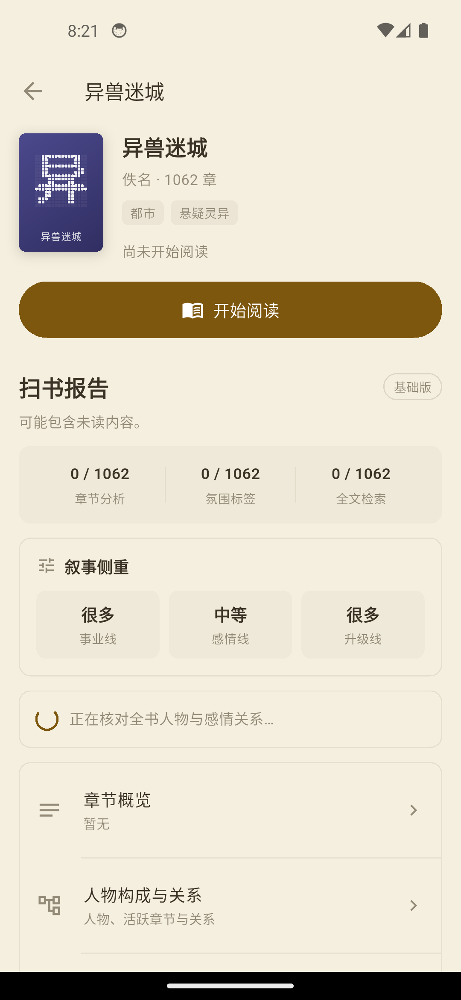
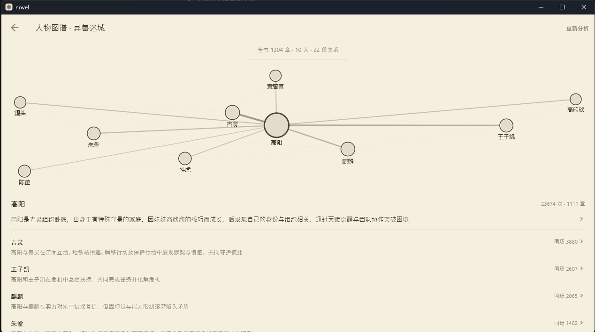
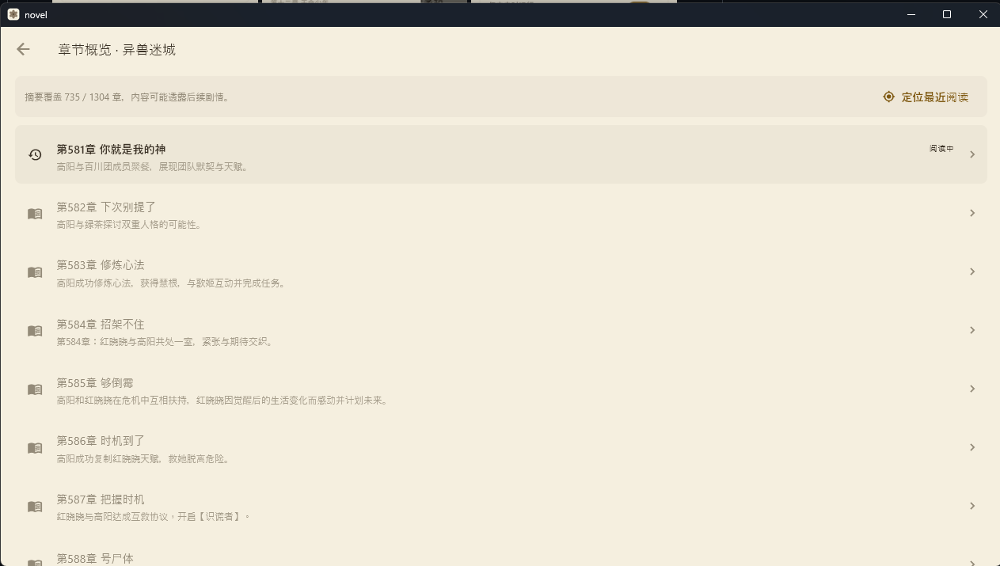
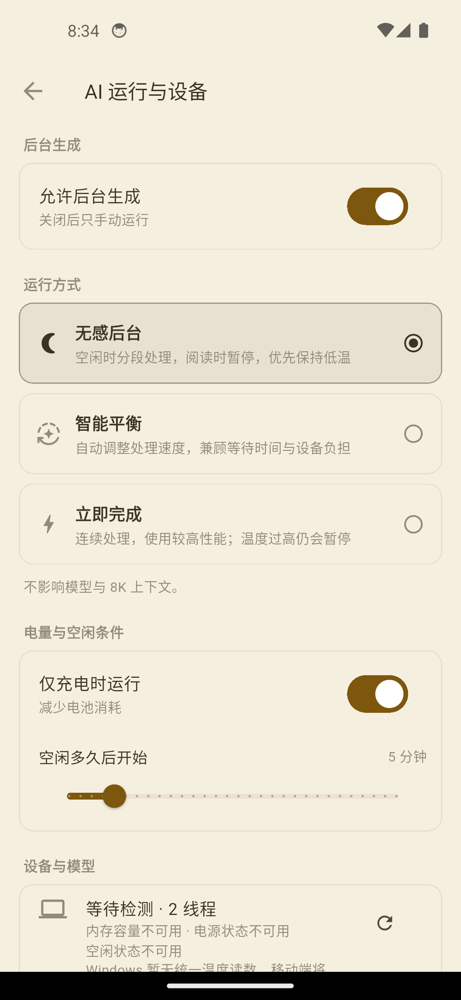

# Novel

[简体中文](README_ZH.md) | English

  

<strong>A quieter way to read Chinese web fiction.</strong> Local AI, searchable stories, and reading notes that stay with you.

  <a href="https://envymoon.github.io/EdgeNovel/"><strong>Open the project showcase →</strong></a>

A local-first novel reader designed for Chinese web fiction, with mobile as its final destination.

The project brings small language models, rule-based retrieval, and reading data onto the user's own device. Its goal is to make AI useful both before and during reading—without turning reading into a permanently connected cloud conversation.

> This project is in early development. The Windows version is currently used to refine the complete experience. The Android version has completed its first migration and emulator validation. iOS development will continue once a macOS build environment is available.

## Why This Project Exists

Readers of long-form Chinese web fiction often need answers to questions more specific than “What does this paragraph mean?”:

- Is a novel with hundreds or thousands of chapters worth starting?
- Do its protagonist, main cast, and romance structure match the reader's preferences?
- Which potentially unwanted story elements may appear, and what passages support that conclusion?
- After a long break, how can the reader quickly find a character, earlier event, or relevant chapter?

The product is therefore organized into two distinct layers.

### Pre-reading Report

The report appears on the book details page before the reader starts the novel. It currently covers the cast graph, romance structure, narrative focus, chapter overview, mood and pacing, potentially sensitive plot excerpts, and links to the supporting passages.

A small model cannot reliably make unrestricted, book-wide judgments about a very long novel. This project therefore does not delegate every conclusion to AI. Rules and retrieval provide stable, inspectable results; the lightweight model is reserved for bounded tasks it can handle. Whenever possible, users can return to the original chapter and make the final judgment themselves.

### Reading Assistant

The in-reader assistant provides character lookup, chapter overviews, semantic search, and reading-related tools. It is kept separate from the pre-reading report so that choosing a book and reading a book do not become the same workflow.

## See It in the Reader

  
  
  

The same flow moves from **book choice** to **reading** to **personal annotation**. These are screenshots of the current Chinese web-fiction flow; the English captions describe the product surface, not an English novel pipeline.

### A small reading moment

> Rain traced the window. He closed the chapter, left one line for later, and returned to the exact place where the story had paused.

This short English passage is original showcase copy. It is not a bundled test novel.

### Inside the scan report

  

  

  

The cast graph and chapter overview above are real captures from the app. The underlying evidence remains tied to Chinese novel chapters.

## Current Content Support

The interface can be switched to English in the current source, but an English interface does not automatically add English novel support; the current analysis pipeline is dedicated to **Chinese web fiction**. English novels such as *The Great Gatsby* are not a supported content target yet: chapter detection, retrieval, relationship analysis, and scan reports may be incomplete or fail.

## Features

- Local TXT import, encoding handling, chapter detection, and custom shelf categories
- Reading-position recovery, latest-chapter tracking, and completion marks for chapters actually read
- Chapter navigation and a shortcut back to the current reading position
- Inline annotations with management and source-location navigation
- Cast graph, romance structure, and narrative-focus analysis
- Potentially sensitive plot excerpts with neighboring context and chapter links
- Chapter overviews, mood and pacing views, and full-text semantic search
- Recoverable local AI task queue with pause, retry, and chapter-level checkpoints
- Low-impact background, balanced, and finish-now workload modes
- Charging, battery, idle-time, and thermal constraints
- On-demand model downloads, integrity checks, resume support, and version rollback
- On-demand fonts and mobile-oriented reading interactions

### Core workflows at a glance

| Before reading | While reading | Under the hood |
| --- | --- | --- |
| Cast graph, romance structure, pacing, and potential spoiler evidence | Chapter jump, current-position recovery, annotations, and semantic search | On-device models, resumable tasks, workload limits, and model rollback |

## AI on Edge Devices

The current generation baseline is **Qwen3 0.6B Q8**, with **BGE small Chinese F16** for semantic retrieval. Generative features retain the tuned **8K context window**. Workload modes adjust threads, scheduling, intervals, and model unloading; they do not reduce context length to gain speed.

Models are not bundled with the installer. They are downloaded only when the related feature is requested, keeping the application package smaller and allowing model updates or rollbacks independently of app releases.

Target device tiers (pending broader physical-device testing):

| Tier | Suggested device | Local AI support |
| --- | --- | --- |
| Reading first | 4GB RAM or less | Core reading features; generative AI is not guaranteed |
| Experimental minimum | 6GB RAM, ARM64, Android 10+ | Fixed 8K context and one foreground task at a time |
| Standard | 8GB RAM or more | Full local AI feature set |
| High performance | 12GB RAM or more | Fast mode and future enhanced models |

Actual performance depends on the processor, available memory, operating-system background limits, and cooling—not memory capacity alone.

## Edge-first Workload Design

Edge computing is not only about placing a model on the device. Novel continuously adjusts **when** and **how much** work is done so reading stays responsive:

- It combines charging state, battery level, thermal state, idle time, memory pressure, and task priority before starting a slice of work.
- **Quiet idle** works in small slices, yields to the reader, and unloads the model between longer intervals when possible.
- **Balanced** keeps a steady background pace for chapter analysis and retrieval.
- **Finish now** uses the available resources to complete a requested result sooner, while still respecting device safety limits.
- These modes change scheduling, thread count, intervals, and model residency—not the tuned 8K context or the meaning of the result.

The goal is not to pretend that inference has no cost. It is to make that cost adaptive, visible, and appropriate for a phone that is also being used for reading.

## Platform Status and Downloads

Windows and Android use separate GitHub Releases. Their packages and release tags are not shared.

### Windows

**Release tag:** [`windows-v1.0.0`](https://github.com/envymoon/EdgeNovel/releases/tag/windows-v1.0.0)  
**Download:** `Novel-Windows-x64-1.0.0.zip`

Windows is currently the most complete version. The `novel.exe` file must remain beside the bundled `data` directory and DLL files; copying or downloading the executable alone will not work.

Current status: the first public Windows 1.0.0 release is available. The source now includes the interface-language switch, but this published package predates that change; a new Windows package is required for the switch to appear in the installed app. Download the complete ZIP; the executable must stay beside its `data` directory and DLL files.

### Android

**Release tag:** [`android-v1.0.0-preview.1`](https://github.com/envymoon/EdgeNovel/releases/tag/android-v1.0.0-preview.1)  
**Download:** `Novel-Android-arm64-v8a-1.0.0-preview.1.apk`

The Android migration includes emulator tests for the bookshelf, book details, settings, reader, annotations, chapter navigation, completed-chapter marks, background recovery, model download failures, and Android system-back behavior.

Current status: the first ARM64 Android preview is available. It uses a development signing key and has not yet been validated on a physical phone; a later official signing key may require reinstalling the app.

### iOS

There is no distributable iOS build yet. The shared UI and data layers are being prepared for mobile, while the native project, Metal inference, background scheduling, signing, and device testing require macOS and Xcode.

See the [release guide](docs/RELEASING.md) for platform-specific packaging rules.

## Repository Structure

- `app/`: Flutter UI, platform projects, application state, and shared mobile layer
- `app/rust/`: Rust data and AI bridge used by the application
- `core/`: novel parsing, cast, relationship, romance, and diagnostic algorithms
- `tts-server/`: optional text-to-speech service
- `app/docs/`: mobile migration and implementation notes

## Current Limitations

- A 0.6B model cannot independently understand an entire long-form web novel with consistent accuracy. Some analysis may still miss evidence or produce incorrect results.
- The pre-reading report supports decision-making; it is not a definitive statement about a novel. Important results should be checked against their source passages.
- Android has not yet undergone physical-device testing for memory use, temperature, battery consumption, or long-running background behavior.
- Native iOS development has not started.
- No open-source license has been selected yet. Until a license is added, no permission is granted to copy, modify, or redistribute the code.

## Roadmap

The short-term priority is physical-device validation while keeping the Windows version stable. The next stage will fine-tune a model on purpose-built Chinese web-fiction data to improve character, relationship, chapter, and content-screening tasks instead of simply increasing the on-device model size.

## Content and Privacy

Novel text, reading history, annotations, and generated caches are stored locally by default. The public repository and Releases do not include test novels, user databases, model weights, or personal reading data. Users should only import content they are authorized to use.
